<h1 align="center">Atlas</h1>

<p align="center">
  <strong>Event:</strong> Software Development<br>
  <strong>Team #:</strong> SDHS~21361-3
</p>

---

## The Challenge


Atlas was developed in response to the 2026 TSA Software Development theme.

The challenge asked us to design software that improves Accessibility. When analyzing existing solutions, we found a clear technical limitation: most accessibility tools are either separate (vision or hearing) or heavily dependent on cloud APIs, which makes them unreliable in environments without stable internet access.

Our solution to this problem is Atlas. Atlas is a unified, offline-capable accessibility assistant designed to run locally on standard hardware. By leveraging optimized edge AI, the system delivers real-time sensory assistance without relying on cloud infrastructure, reducing latency while improving reliability.

---

## Features

### Vision Assist Mode

*Target User: Blind / Low Vision*


* **Low-Latency Object Detection**
  Spots obstacles and items using a local MobileNet-SSD model.


* **“What am I looking at?” Descriptions**
  Generates natural descriptions like *“I see a person, a laptop, and a coffee cup.”*

* **OCR Text Reader**
  Reads printed text from menus, signs, and documents using EasyOCR.


* **Live Video Overlay**
  Displays bounding boxes and labels so users can see exactly what the AI is detecting in real time. (This is mainly for us to test, but also for caretakers).

### Hearing Assist Mode

*Target User: Deaf / Hard of Hearing*

* **Near Real-Time Captioning**
  Local speech-to-text transcription using the Whisper model.


* **Safety Alert System**
  We engineered a custom sound classifier that listens for Fire Alarms, Sirens, and Doorbells and triggers visual warnings if danger is detected.

* **Multi-Language Support**
  Automatically identifies the spoken language during transcription.

### Accessibility-First Design


* **WCAG-Aligned UI**
  High-contrast (white-on-dark) interface for improved readability.


* **Full Keyboard Navigation**
  The application can be operated entirely without a mouse.

---

## Architecture

Atlas uses a hybrid client–server architecture that separates the user interface from the heavy AI processing. This design ensures that intensive model processing never blocks or freezes the frontend during real-time use.



### Backend Processing Pipeline


---

## Project Structure

```text
Atlas/
├── atlas-backend/              # Flask API Server (The Brains)
│   ├── app.py
│   ├── vision_processor.py
│   ├── sound_classifier.py
│   └── requirements.txt
│
├── atlas-frontend/             # PyQt6 Desktop Client (The Face)
│   ├── main.py
│   ├── tts_engine.py
│   ├── audio_engine.py
│   ├── data_overlay.py
│   └── requirements.txt
│
├── atlas-mobile/               # React Native Mobile App (Production)
│   ├── App.tsx
│   ├── package.json
│   ├── assets/models/
│   └── src/
│       ├── screens/            # VisionScreen, HearingScreen, SettingsScreen
│       ├── hooks/              # useVisionAnnouncer, useAlarmDetector, useOcrAutoReader
│       ├── contexts/           # SettingsContext (AsyncStorage persistence)
│       ├── utils/              # tensor_decoder, ocr_utils, haptic_patterns, ...
│       └── components/         # DetectionOverlay, OcrTextPanel, AlertOverlay, ...
│
├── model_engineering/
│   ├── convert_model.py
│   ├── coco_labels.txt
│   ├── README.md
│   └── output/
│
└── README.md
```

---

## Getting Started

**Requirements:** Python 3.10+, Git

### 1. Clone the Repo

```bash
git clone https://github.com/yourusername/atlas.git
cd atlas
```

### 2. Backend Setup

```bash
cd atlas-backend
python -m venv venv
pip install -r requirements.txt
```

*Note: The first run might take a minute to download the Whisper models.*

### 3. Frontend Setup

```bash
cd ../atlas-frontend
python -m venv venv
# Windows: venv\Scripts\activate
# Mac/Linux: source venv/bin/activate
pip install -r requirements.txt
```

### 4. Launch!

1. Start backend: `python app.py`
2. Start frontend: `python main.py`

---

## Mobile Production Release

Atlas Mobile is a fully featured, production-ready Android application that achieves feature parity with the desktop client, running entirely on-device with no internet or server dependency.

Built with React Native and Expo, the app ships with our custom 3.99 MB quantized TFLite model and a complete multi-screen navigation architecture (Vision, Hearing, Settings).

<p align="center">
  
</p>

### Mobile Feature Highlights

* **Directional Spatial Awareness TTS**
  Detected objects are announced with Left / Center / Right positioning derived from their bounding-box centroid, producing natural sentences like *"I see a person on the left and a laptop in the center."* A per-label cooldown and leading-edge debounce prevent repetitive announcements without missing new objects.

* **On-Device OCR Text Reader**
  Powered by ML Kit via `react-native-vision-camera-ocr-plus`, the Vision screen recognises printed text in real time directly on the device. A smart auto-reader compares successive results using string similarity and only speaks when the content is substantially new. A tap-anywhere fallback re-reads the latest text on demand.

* **Persistent Accessibility Settings Panel**
  A dedicated Settings screen exposes four user-tunable preferences: TTS Voice Speed (0.5 – 2.0×), Caption / OCR Text Size (16 – 32 px), Crisis Mode Sensitivity (FFT peak threshold 40 - 160), and the Haptic Vocabulary toggle, all persisted across sessions via AsyncStorage.

* **Haptic Vocabulary**
  Distinct vibration rhythms provide silent safety alerts for deaf-blind users. Fire alarms trigger an SOS pulse (· · · — — — · · ·), sirens trigger alternating long pulses, and new-speaker detection triggers a light double-tap. Custom `Vibration.vibrate()` patterns run on Android; `expo-haptics` notification types provide the closest approximation on iOS.

* **Real-Time Frame Processing**
  Live camera inference runs at a target FPS using `react-native-fast-tflite` and `vision-camera-resize-plugin`, with bounding-box overlays rendered via an SVG detection layer.

* **Real-Time FFT Alarm Detection**
  The Hearing screen uses `react-native-audio-api` (Web Audio API compatible) to run native FFT analysis on microphone input. A peak-based + ratio hybrid algorithm detects fire alarms, smoke detectors, and emergency sirens and fires immediate visual and haptic alerts.


---

## Model Engineering

Standard server-side models are too large for mobile phones. We built a custom quantization pipeline to reduce the model size from ~30MB to 3.99MB while preserving accuracy.

**Result:** 96% size reduction using dynamic range quantization.

| Model              | Input Size | Speed | Size  |
| ------------------ | ---------- | ----- | ----- |
| `ssd_mobilenet_v1` | 300×300    | Fast  | ~4 MB |


**Reproduction:**

```bash
cd model_engineering
pip install -r requirements.txt
python convert_model.py
```

---

## Tech Stack

* **Backend:** Python, Flask, PyTorch, OpenCV, Whisper
* **Frontend:** Python, PyQt6, pyttsx3
* **Mobile:** TypeScript, React Native, Expo, TensorFlow Lite, ML Kit OCR, Web Audio API
* **Tools:** Git, Mermaid.js, VS Code

---

## To you, the reviewer

Thank you for taking the time to review our project!

Building Atlas pushed us to learn entirely new frameworks, design for real-world constraints, and dive deep into AI engineering. It was a challenging but incredibly rewarding experience to turn this idea into a working product.

We appreciate your time and consideration!
